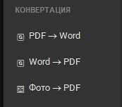
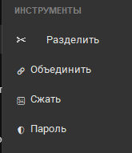
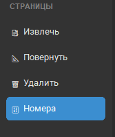

# 📄 PDF Converter App

Простой, быстрый и полностью локальный десктопный инструмент для работы с PDF.
Никаких облаков, никакой отправки файлов на сервер, никаких подписок — всё работает прямо на вашем ПК.


## 🖼 Скриншоты

<!-- Когда добавишь скриншоты в папку screenshots/, раскомментируй и вставь пути -->
| Конвертация | Инструменты | Страницы |
| --- | --- | --- |
|  |  |  |

## ✨ Возможности

### 🔄 Конвертация
| Функция | Описание |
| --- | --- |
| PDF → Word | Конвертация с сохранением разметки, таблиц и изображений |
| Word → PDF | Быстрая конвертация `.docx` в PDF с поддержкой кириллицы |
| Фото → PDF | Создание PDF из нескольких изображений (JPG, PNG, BMP) |

### 🛠 Инструменты
| Функция | Описание |
| --- | --- |
| Разделить | Разбивает многостраничный PDF на отдельные файлы |
| Объединить | Склеивает несколько PDF в один документ |
| Сжать | Уменьшает размер файла со статистикой экономии |
| Пароль | Защита PDF паролем (128-бит шифрование) |

### 📑 Страницы
| Функция | Описание |
| --- | --- |
| Извлечь | Извлечение страниц по диапазону (например: `1-5, 8, 12-15`) |
| Повернуть | Поворот страниц на 90° / 180° / 270° (все или выбранные) |
| Удалить | Удаление ненужных страниц из документа |
| Номера | Добавление нумерации внизу каждой страницы |

### 🚀 Дополнительно
- 📦 **Пакетная обработка** — конвертируйте целые папки файлов за один клик
-  **Прогресс-бары** — видно статус обработки каждого файла
- 🔄 **Автообновления** — приложение само проверяет и предлагает новые версии
- 🎨 **Современный интерфейс** — тёмное боковое меню, карточки, анимации (pywebview + HTML/CSS)

## 📥 Установка (для обычных пользователей)

1. Перейдите в раздел [Releases](../../releases).
2. Скачайте последнюю версию `PDF_Converter_Setup.exe`.
3. Запустите установщик и следуйте инструкциям.

### ⚠️ Если ругается Windows SmartScreen
Программа бесплатная и без цифровой подписи, поэтому может появиться синее окно:
1. Нажмите «Подробнее...» (More info)
2. Затем «Выполнить в любом случае» (Run anyway)

Программа полностью безопасна, работает локально и не отправляет ваши файлы в интернет.

### 🔄 Обновления
Приложение само проверяет наличие новых версий при запуске (файл `update/version.json` в репозитории).
При выходе обновления появится уведомление — установка заменит старую версию автоматически.

## 🛠 Сборка из исходников (для разработчиков)

### Автоматический способ (рекомендуется)
1. Установите [Python 3.10+](https://www.python.org/downloads/) — обязательно поставьте галочку "Add Python to PATH".
2. Установите [Inno Setup 6](https://jrsoftware.org/isinfo.php) в стандартную папку.
3. Скачайте репозиторий и запустите `build.bat` двойным кликом.

Скрипт автоматически:
- Создаст виртуальное окружение
- Установит все зависимости из `requirements.txt`
- Сгенерирует иконку `pdf.ico` (если её нет) через `make_icon.py`
- Соберёт `.exe` через PyInstaller
- Упакует всё в установщик через Inno Setup

Готовый `PDF_Converter_Setup.exe` появится на Рабочем столе.

### Ручной способ
```bash
git clone https://github.com/ekadvladsheglov-tech/PDF-Converter-App.git
cd PDF-Converter-App
python -m venv venv
venv\Scripts\activate
pip install -r requirements.txt
python make_icon.py
python app_web.py